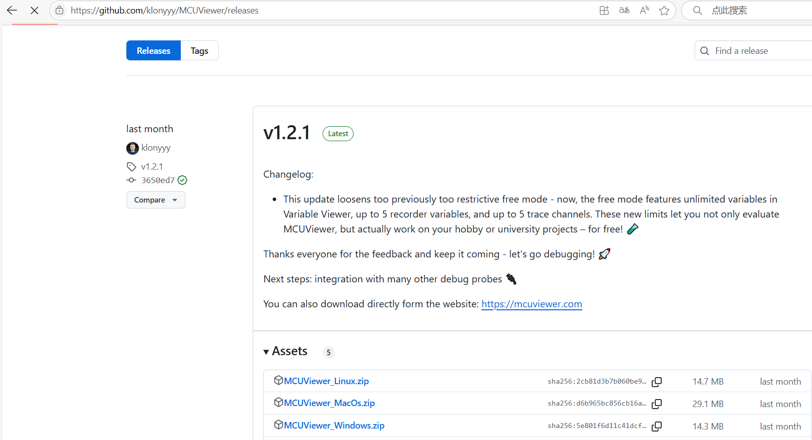
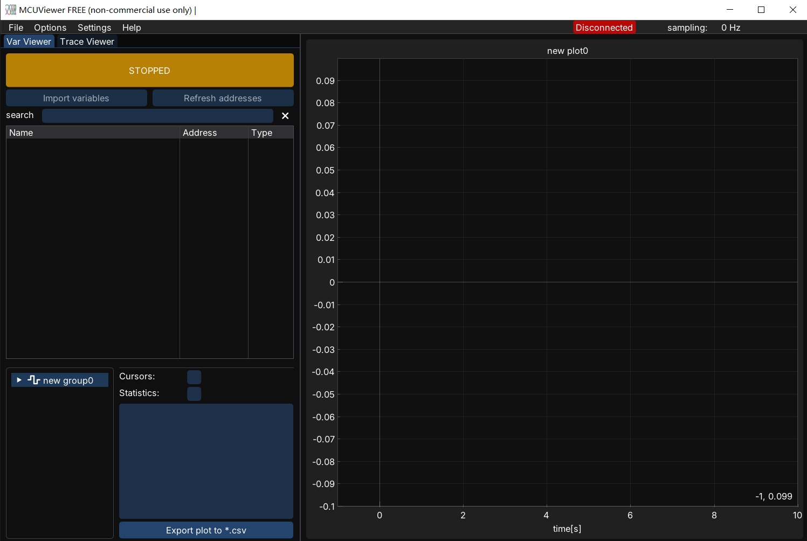
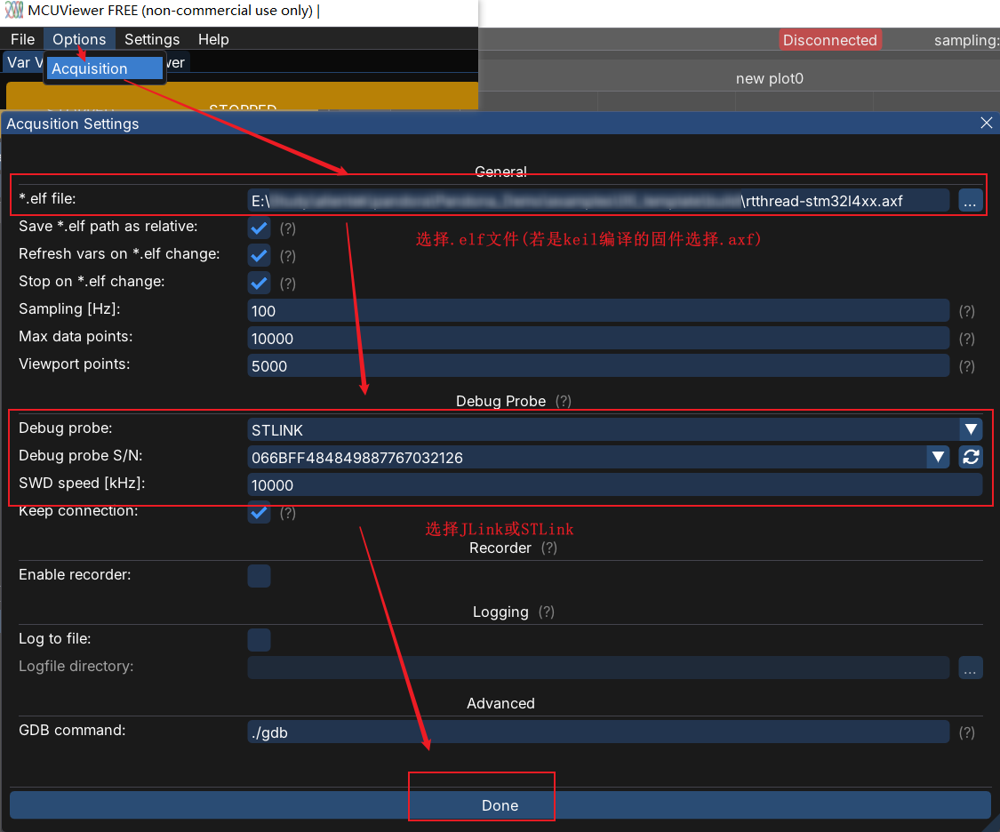
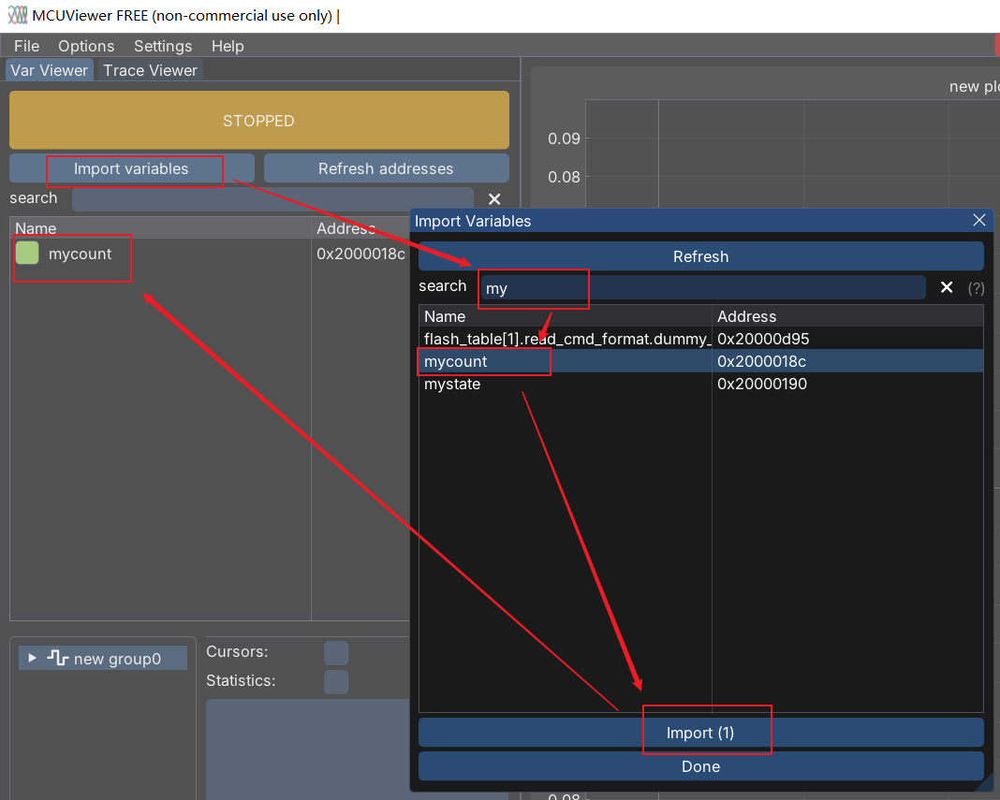
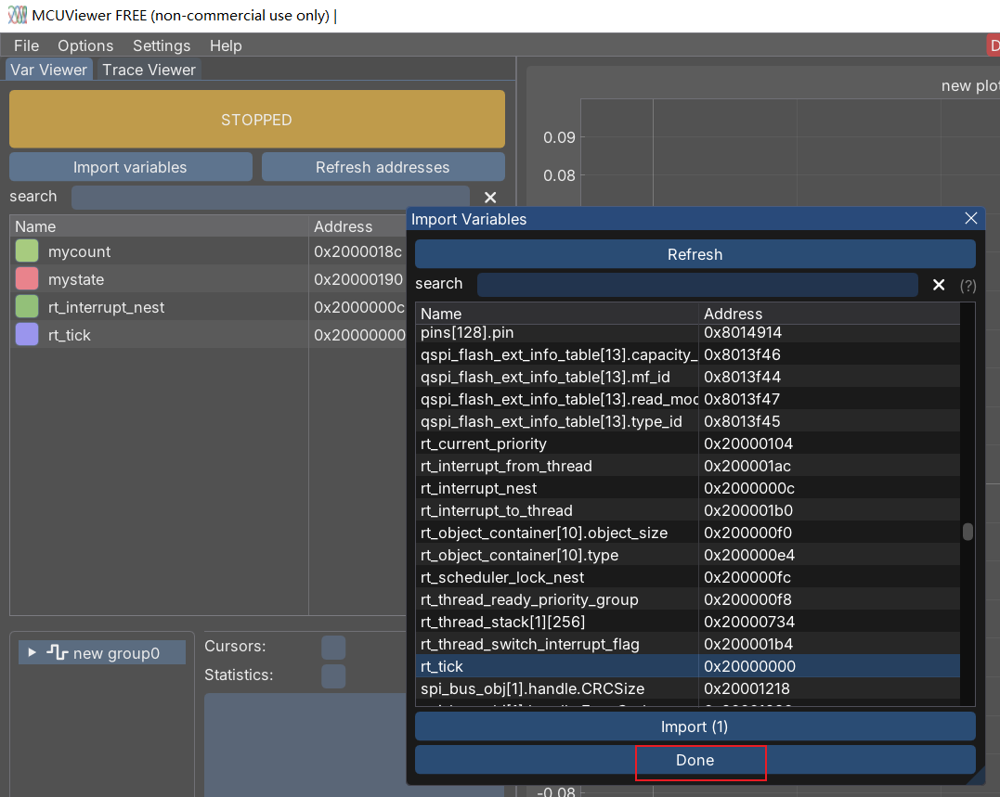
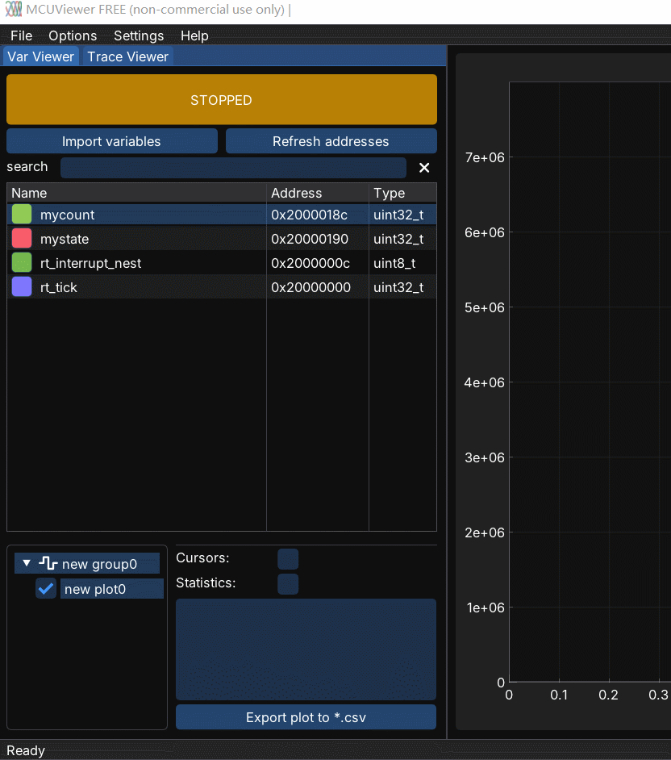
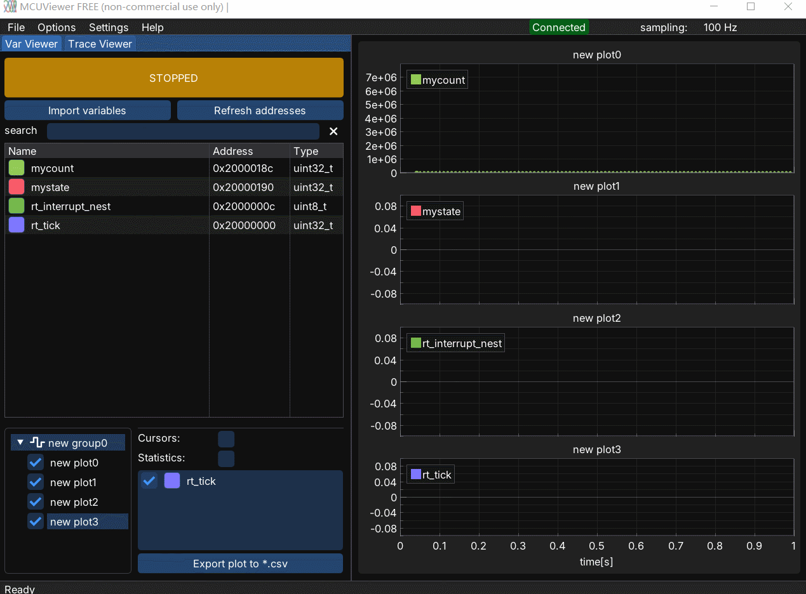

> MCUViewer支持JLink和STLink。

## 1. 下载MCUViewer
进入[MCUViewer](https://github.com/klonyyy/MCUViewer)下载。

对于windows，解压`MCUViewer_Windows.zip`并点击`MCUViewer-x.x.x-win64.exe`安装MCUViewer。

## 2. 编译并将固件通过JLink或STLink烧录到MCU中

## 3. 打开MCUViewer

## 4. 设置MCUViewer
按下图添加和MCU固件一同编译的`.elf`文件，并选择使用的仿真器，如STLink。

## 5. 在Var Viewer中添加需跟踪的变量
添加变量步骤如下图：

添加所有需跟踪的变量添加后，按`Done`返回主界面。

## 6. 将需跟踪的变量加入到图表中

将需跟踪的变量加入到单独的图表组中：

## 7. 按STOP按钮启动MCUViewer跟踪变量

