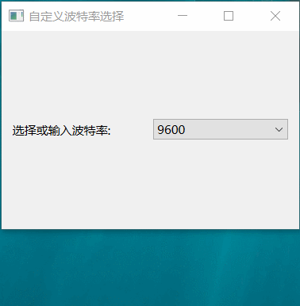

```python
import sys
from PySide6.QtWidgets import QApplication, QWidget, QHBoxLayout, QComboBox, QLabel, QLineEdit
from PySide6.QtGui import QIntValidator


class CustomBaudRateWidget(QWidget):
    def __init__(self):
        super().__init__()
        self.initUI()

    def initUI(self):
        # 创建主布局
        layout = QHBoxLayout()

        # 创建用于显示提示信息的标签
        label = QLabel("选择或输入波特率:")
        layout.addWidget(label)

        # 创建 QComboBox
        self.baud_rate_combo = QComboBox(self)

        # 预设常用的波特率选项
        baud_rates = ["9600", "115200", "19200", "38400", "57600", "自定义"]
        self.baud_rate_combo.addItems(baud_rates)
        self.baud_rate_combo.currentIndexChanged.connect(self.on_baud_rate_index_changed)
        self.baud_rate_combo.currentTextChanged.connect(lambda : print(f"当前波特率为{self.baud_rate_combo.currentText()}"))

        layout.addWidget(self.baud_rate_combo)

        # 将布局应用到窗口
        self.setLayout(layout)
        self.setWindowTitle('自定义波特率选择')
        self.setGeometry(300, 300, 300, 200)

    def on_baud_rate_index_changed(self, index):
        if self.baud_rate_combo.currentText() == "自定义":
            # 设置QLineEdit
            line_edit = QLineEdit()
            self.baud_rate_combo.setLineEdit(line_edit)
            # 设置占位符
            line_edit.setPlaceholderText("请输入波特率")
            line_edit.clear()
            # 将line_edit设置为仅可输入整数
            validator = QIntValidator()
            line_edit.setValidator(validator)
        else:
            self.baud_rate_combo.setEditable(False)


if __name__ == '__main__':
    app = QApplication(sys.argv)
    window = CustomBaudRateWidget()
    window.show()
    sys.exit(app.exec())

```

## 效果


